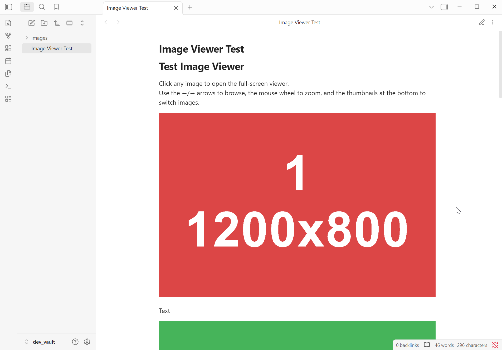

# Obsidian Image Viewer

*English · [Русский](README.ru.md)*

Click an image in a note to open it in a full-window viewer that fills the whole Obsidian window.



## Features

- **Full-window viewing** — the image is scaled automatically to fit the window.
- **Thumbnail gallery** at the bottom — every image in the current note in a single horizontal row of uniform size. The active one is highlighted; click to switch.
- **Arrow-key navigation** `←` / `→` — previous / next image.
- **Mouse-wheel zoom** — zooms toward the cursor; you can also shrink below the fitted size.
- **Drag to pan** when the image is zoomed in.
- **Double click** — toggle between the default zoom and 2×.
- **Esc** or a click on the dark backdrop closes the viewer. `+` / `-` / `0` zoom from the keyboard.

## Settings

Available in **Settings → Community plugins → Image Viewer**:

| Option | Description |
|---|---|
| **Show thumbnail gallery** | show/hide the bottom thumbnail strip |
| **Thumbnail height** | thumbnail height (40–160 px); width follows the orientation |
| **Thumbnail orientation** | thumbnail shape: landscape / portrait / square |
| **Center thumbnail gallery** | center the gallery when it fits (otherwise left-aligned and scrollable) |
| **Show navigation arrows** | show/hide the ‹ › arrows (arrow keys always work) |
| **Show file name** | show the current file name in the top bar (centered) |
| **Mouse wheel** | wheel mode: *Zoom* — wheel zooms, arrows navigate; *Navigate* — wheel navigates, Ctrl/Cmd+wheel zooms |
| **Default zoom** | zoom on open: *fit without upscaling* (default), *fit with upscaling*, *fill height*, *fill width*, *100%* |
| **Keep zoom between images** | preserve zoom level and position when switching images |
| **Loop navigation** | wrap around from the last image to the first and vice versa |
| **Close on backdrop click** | close by clicking the dark backdrop (the close button is hidden when enabled) |
| **Backdrop opacity** | how dark the background is (0.5–1.0) |
| **Minimum zoom** | lower zoom limit (< 1.0 lets you shrink below the default size) |
| **Maximum zoom** | upper zoom limit (× the default size) |
| **Zoom step** | wheel sensitivity — how much one notch zooms |

Settings are stored in the plugin's `data.json` and applied the next time the viewer opens.

## Build

```bash
npm install
npm run build      # produces main.js
npm run deploy     # build + copy into dev_vault for testing
```

For development: `npm run dev` (watch build), then run `./deploy.ps1` manually.

## Manual installation

Copy `main.js`, `manifest.json` and `styles.css` into
`<vault>/.obsidian/plugins/image-viewer/` and enable the plugin in Obsidian's settings.
